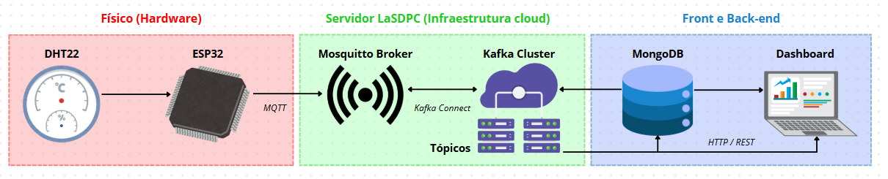

# Projeto de Plataforma de Fluxo de Dados Integrada

## Visão Geral
Sistema completo de monitoramento ambiental com ESP32, sensor DHT22, Mosquitto, Kafka e MongoDB. Coleta dados de temperatura/umidade, transmite via MQTT, processa com Kafka e armazena no MongoDB para visualização.

## Hardware Necessário
- **ESP32-WROOM-32**
- **Sensor DHT22**
- Protoboard e jumpers
- Fonte USB 5V

## Conexões Físicas
| Pino ESP32 | Conexão DHT22 |
|------------|---------------|
| 3.3V       | VCC           |
| GND        | GND           |
| GPIO4      | DATA          |

## Software
- Arduino IDE (para ESP32) 
- Mosquitto MQTT Broker
- Apache Kafka
- MongoDB
- Python 3.8+ (para consumidor Kafka)
- Docker + Docker Compose
- Interface web em Flask (em container)

## Fluxo de Dados



```plaintext
ESP32 (simula temperatura e umidade)
       ↓ MQTT
Mosquitto Broker local (localhost:5054)
       ↓
Tópico MQTT: sensor_temperatura
       ↓
Python (MQTT → Kafka)
       ↓
Kafka local (localhost:9092)
       ↓
Python Consumer Kafka
       ↓
MongoDB local (localhost:27017 → banco: COMP_NUVEM, coleção: dadosTempTopico)
```

## Como Executar o Projeto

1. **Clone o repositório:**

```bash
git clone https://github.com/ProfJCE-Disciplinas/cloud-project-ssc0158-2025-grupo-4
cd cloud-project-ssc0158-2025-grupo-4
```

2. **Verifique se você possui Docker e Docker Compose instalados:**

```bash
docker --version
docker compose version
```

3. **Suba os containers com Docker Compose:**

```bash
docker compose up --build
```

⚠️ Aguarde até que todos os serviços estejam iniciados. Os principais serviços estarão disponíveis nas portas:

- Mosquitto: `localhost:5054`
- Kafka: `localhost:9092`
- MongoDB: `localhost:7054`
- Aplicação Web (Flask): `http://localhost:7154`

4. **Configure e suba seu ESP32:**

   - Use o código `configesp32.ino`
   - Configure o endereço MQTT para `broker.mqtt-dashboard.com` ou `SEU_IP_LOCAL:5054`
   - Certifique-se de que o tópico usado é `sensor_temperatura`

5. **Acesse a aplicação web:**

   No navegador, abra: [http://localhost:7154](http://localhost:7154)

   A interface exibe os dados armazenados no MongoDB (temperatura e umidade) em formato gráfico.

---


## Autores

- Beatriz Vieira – vieira.beatriz@usp.br
- Eduardo Garcia de Gaspari Valdejão – eduardo.gdgv@usp.br
- Gabriel Vasconcelos de Arruda – gabrielvascoarruda@usp.br
